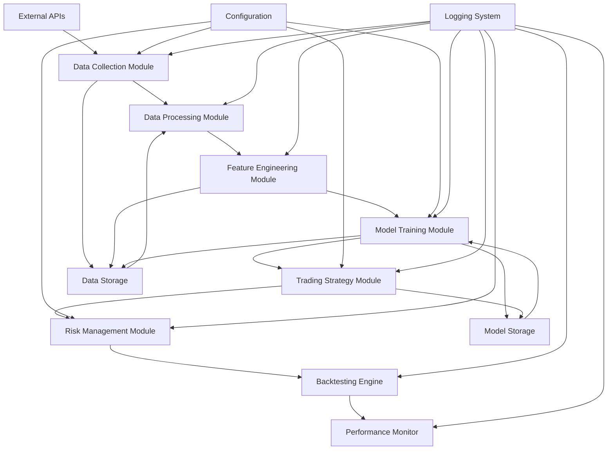

# Design Document

## Overview

The Quantitative Trading System is a comprehensive machine learning-based trading platform that combines LSTM neural networks for price prediction with Deep Q-Network (DQN) reinforcement learning for action selection. The system integrates sentiment analysis from news headlines and implements robust risk management to trade Indian stocks with the goal of outperforming the NIFTY 50 benchmark.

The architecture follows a modular design with clear separation of concerns: data collection, feature engineering, model training, trading strategy execution, and performance monitoring. The system is designed to be scalable, maintainable, and extensible for future enhancements.

## Architecture



### Core Components

1. **Data Collection Module**: Fetches market data and news from yfinance API
2. **Data Processing Module**: Cleans and validates raw market data
3. **Feature Engineering Module**: Calculates technical indicators and sentiment scores
4. **Model Training Module**: Trains LSTM and DQN models
5. **Trading Strategy Module**: Executes trading decisions using trained models
6. **Risk Management Module**: Implements position sizing and stop-loss controls
7. **Backtesting Engine**: Simulates trading strategy on historical data
8. **Performance Monitor**: Tracks and visualizes system performance

## Components and Interfaces

### Data Collection Module

**Purpose**: Fetch and store market data and news headlines from external sources.

**Key Classes**:
- `DataCollector`: Main orchestrator for data collection
- `YFinanceClient`: Wrapper for yfinance API interactions
- `StockDataFetcher`: Handles individual stock data retrieval
- `NewsDataFetcher`: Retrieves news headlines for sentiment analysis

**Interfaces**:
```python
class IDataSource:
    def fetch_stock_data(self, symbol: str, start_date: str, end_date: str) -> pd.DataFrame
    def fetch_news_data(self, symbol: str, start_date: str, end_date: str) -> List[Dict]

class IDataStorage:
    def save_stock_data(self, symbol: str, data: pd.DataFrame) -> bool
    def load_stock_data(self, symbol: str) -> pd.DataFrame
    def save_news_data(self, symbol: str, news: List[Dict]) -> bool
```

### Data Processing Module

**Purpose**: Clean, validate, and prepare raw data for feature engineering.

**Key Classes**:
- `DataCleaner`: Removes missing values and handles outliers
- `DataValidator`: Validates data integrity and completeness
- `DataNormalizer`: Applies scaling and normalization

**Processing Pipeline**:
1. Remove rows with missing OHLCV values
2. Cap outliers at 3 standard deviations
3. Validate data consistency and completeness
4. Apply min-max scaling to numerical features

### Feature Engineering Module

**Purpose**: Calculate technical indicators and process sentiment data.

**Key Classes**:
- `TechnicalIndicators`: Calculates RSI, SMA, Bollinger Bands
- `SentimentAnalyzer`: Processes news headlines using DistilBERT
- `FeatureBuilder`: Combines all features into training datasets

**Technical Indicators**:
- 14-day Relative Strength Index (RSI)
- 50-day Simple Moving Average (SMA)
- 20-day Bollinger Bands (upper, middle, lower)

**Sentiment Processing**:
- Uses pre-trained DistilBERT model for sentiment classification
- Generates sentiment scores between -1 (negative) and +1 (positive)
- Handles missing news data with neutral sentiment (0)

### Model Training Module

**Purpose**: Train and manage LSTM and DQN models.

**LSTM Architecture**:
- 2 LSTM layers with 50 units each
- 0.2 dropout rate for regularization
- Dense output layer for price movement prediction
- Adam optimizer with learning rate scheduling

**DQN Architecture**:
- Deep neural network with experience replay
- Three actions: buy, sell, hold
- Reward function based on Sharpe ratio improvement
- Epsilon-greedy exploration strategy

**Key Classes**:
- `LSTMModel`: Implements LSTM for price prediction
- `DQNAgent`: Implements Deep Q-Network for action selection
- `ModelTrainer`: Orchestrates training process
- `ModelEvaluator`: Validates model performance

### Trading Strategy Module

**Purpose**: Execute trading decisions using trained models.

**Strategy Logic**:
1. LSTM generates price movement predictions
2. DQN selects optimal action based on current state
3. Sentiment scores influence position sizing
4. Risk management rules validate all decisions

**Key Classes**:
- `TradingStrategy`: Main strategy orchestrator
- `SignalGenerator`: Combines LSTM and DQN outputs
- `PositionManager`: Manages open positions
- `OrderExecutor`: Simulates trade execution

### Risk Management Module

**Purpose**: Implement comprehensive risk controls.

**Risk Controls**:
- Stop-loss: 5% below entry price
- Position sizing: 1-2% of capital per trade
- Portfolio diversification: 20-30 stocks maximum
- Sentiment-based adjustments: ±20% position size modification

**Key Classes**:
- `RiskManager`: Main risk control orchestrator
- `PositionSizer`: Calculates appropriate position sizes
- `StopLossManager`: Monitors and executes stop-loss orders
- `PortfolioMonitor`: Tracks portfolio concentration

## Data Models

### Stock Data Model
```python
@dataclass
class StockData:
    symbol: str
    date: datetime
    open: float
    high: float
    low: float
    close: float
    volume: int
    rsi_14: Optional[float] = None
    sma_50: Optional[float] = None
    bb_upper: Optional[float] = None
    bb_middle: Optional[float] = None
    bb_lower: Optional[float] = None
    sentiment_score: Optional[float] = None
```

### Trading Signal Model
```python
@dataclass
class TradingSignal:
    symbol: str
    timestamp: datetime
    action: str  # 'buy', 'sell', 'hold'
    confidence: float
    lstm_prediction: float
    dqn_q_values: Dict[str, float]
    sentiment_score: float
    risk_adjusted_size: float
```

### Position Model
```python
@dataclass
class Position:
    symbol: str
    entry_date: datetime
    entry_price: float
    quantity: int
    stop_loss_price: float
    current_value: float
    unrealized_pnl: float
    status: str  # 'open', 'closed'
```

### Performance Metrics Model
```python
@dataclass
class PerformanceMetrics:
    total_return: float
    annualized_return: float
    sharpe_ratio: float
    max_drawdown: float
    win_rate: float
    total_trades: int
    benchmark_return: float
    alpha: float
    beta: float
```

## Error Handling

### Data Collection Errors
- **Network failures**: Implement exponential backoff retry mechanism
- **API rate limits**: Queue requests with appropriate delays
- **Missing data**: Log warnings and continue with available data
- **Invalid responses**: Validate data format and skip corrupted entries

### Model Training Errors
- **Insufficient data**: Require minimum data points before training
- **Training failures**: Implement checkpointing and resume capability
- **Memory issues**: Use batch processing and gradient accumulation
- **Convergence problems**: Implement early stopping and learning rate adjustment

### Trading Execution Errors
- **Invalid signals**: Validate all trading signals before execution
- **Risk limit violations**: Reject trades that exceed risk parameters
- **Model prediction errors**: Use fallback to previous valid predictions
- **Portfolio state inconsistencies**: Implement state reconciliation

### System-Level Error Handling
- **Configuration errors**: Validate all configuration parameters at startup
- **File I/O errors**: Implement robust file handling with backup mechanisms
- **Memory leaks**: Monitor memory usage and implement cleanup routines
- **Unexpected exceptions**: Comprehensive logging and graceful degradation

## Testing Strategy

### Unit Testing
- **Data processing functions**: Test data cleaning, validation, and normalization
- **Technical indicators**: Verify calculation accuracy against known values
- **Model components**: Test individual neural network layers and functions
- **Risk management rules**: Validate position sizing and stop-loss calculations

### Integration Testing
- **Data pipeline**: Test end-to-end data flow from collection to storage
- **Model training**: Verify LSTM and DQN training with synthetic data
- **Trading strategy**: Test signal generation and position management
- **Performance calculation**: Validate metric calculations with known scenarios

### Backtesting Validation
- **Historical accuracy**: Ensure no look-ahead bias in backtesting
- **Transaction cost modeling**: Verify realistic cost assumptions
- **Slippage simulation**: Model market impact and execution delays
- **Benchmark comparison**: Validate performance attribution analysis

### Performance Testing
- **Data processing speed**: Measure throughput for large datasets
- **Model inference time**: Ensure real-time prediction capability
- **Memory usage**: Monitor resource consumption under load
- **Scalability**: Test system behavior with increasing number of stocks

### Stress Testing
- **Market crash scenarios**: Test system behavior during extreme market conditions
- **Data quality issues**: Simulate missing or corrupted data scenarios
- **Model degradation**: Test system response to poor model performance
- **Resource constraints**: Test behavior under limited memory/CPU conditions

## Configuration Management

### Environment Configuration
- Development, testing, and production environments
- Database connection strings and API credentials
- Model hyperparameters and training configurations
- Risk management parameters and trading rules

### Model Configuration
- LSTM architecture parameters (layers, units, dropout)
- DQN hyperparameters (learning rate, epsilon, replay buffer size)
- Training parameters (epochs, batch size, validation split)
- Feature engineering settings (indicator periods, normalization methods)

### Trading Configuration
- Stock universe definition (symbols, market caps)
- Risk management rules (stop-loss, position sizing, diversification)
- Backtesting parameters (initial capital, transaction costs)
- Performance benchmarks and target metrics

## Deployment Considerations

### Development Environment
- Python 3.12 with virtual environment isolation
- Required packages: yfinance, pandas, numpy, tensorflow, transformers
- Development tools: VS Code, Jupyter notebooks for analysis
- Version control: Git with feature branch workflow

### Data Storage
- CSV files for historical data storage in `data/` directory
- Organized by symbol and data type (prices, indicators, sentiment)
- Backup and archival strategy for long-term data retention
- Data versioning for reproducible experiments

### Model Persistence
- Trained models saved in standardized format (TensorFlow SavedModel)
- Model versioning and experiment tracking
- A/B testing framework for model comparison
- Rollback capability for model deployment

### Monitoring and Alerting
- Real-time performance monitoring dashboard
- Automated alerts for system errors and performance degradation
- Daily performance reports and risk metrics
- Model drift detection and retraining triggers